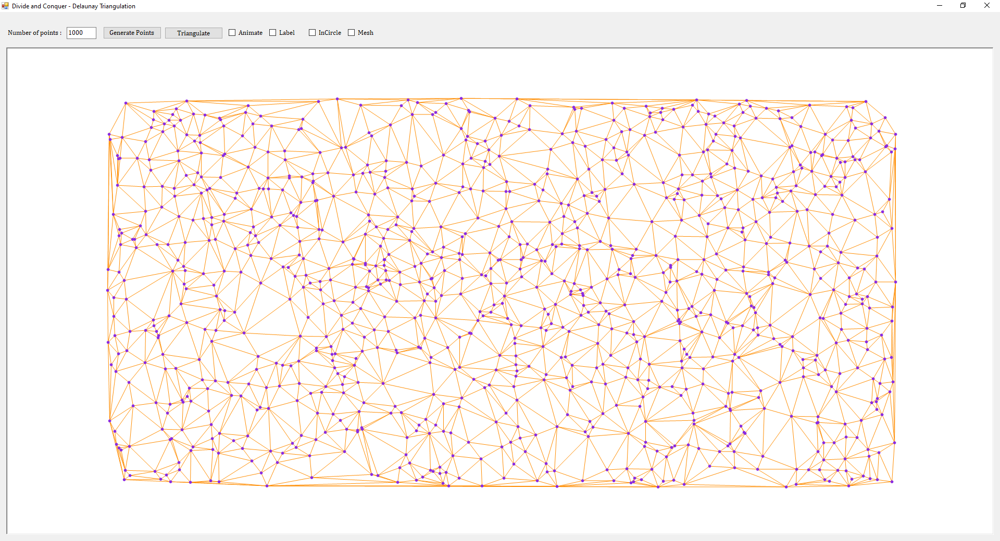
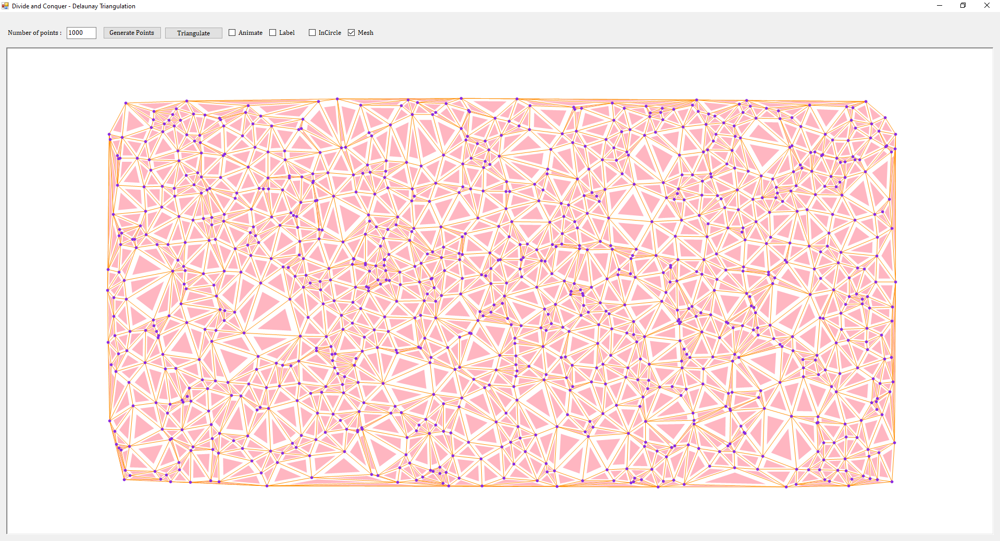

# Delaunay_triangulation_divide_n_conquer
This is a C# implementation of Divide and conquer Delaunay triangulation. The implementation follows Guibas and Stolfi’s paper.  This is the vertical cut implementation of divide and conquer. 

# References
•	Primitives for the manipulation of general subdivisions and the computation of Voronoi diagrams", ACM Transactions on Graphics, 4(2), 1985, 75–123
http://www.sccg.sk/~samuelcik/dgs/quad_edge.pdf

•	Dwyer, R.A., A faster divide-and-conquer algorithm for constructing
Delaunay triangulations. Algorithmica 2(2):137-151, 1987.
https://github.com/rexdwyer/DelaunayTriangulation/blob/master/common.c

•	Lecture Notes on Delaunay Mesh Generation
Jonathan Richard Shewchuk
http://web.mit.edu/ehliu/Public/ProjectX/Summer2005/delnotes.pdf

•	Triangle: Engineering a 2D Quality Mesh Generator and Delaunay Triangulator
https://people.eecs.berkeley.edu/~jrs/papers/triangle.pdf
http://www.geom.uiuc.edu/~samuelp/del_project.html

•	Other
http://www.neolithicsphere.com/geodesica/doc/quad_edge_overview.htm
https://cp-algorithms.com/geometry/delaunay.html
http://www.karlchenofhell.org/cppswp/lischinski.pdf
https://pure.mpg.de/rest/items/item_1819432_4/component/file_2599484/content
https://pure.mpg.de/rest/items/item_1819432_4/component/file_2599484/content
http://hjemmesider.diku.dk/~jyrki/Paper/KK88.pdf 

# Overview
In mathematics and computational geometry, a Delaunay triangulation (also known as a Delone triangulation) for a given set P of discrete points in a plane is a triangulation DT(P) such that no point in P is inside the circumcircle of any triangle in DT(P). Delaunay triangulations maximize the minimum angle of all the angles of the triangles in the triangulation; they tend to avoid sliver triangles. The triangulation is named after Boris Delaunay for his work on this topic from 1934 [from wiki]. Some of the implementation in gitub I checked did triangulations but failed the incircle test.
Guibas and Stolfi’s divide and conquer algorithm uses vertical cuts. Rex Dwyer alternate cut divide and conquer implementation is the fastest implementation of finding Delaunay triangulations for set of points p (J.R.Shewchuk). I’ve implemented vertical cuts in this code and have plans to implement the alternate cut in the next project. 

# Data Structure
I experimented with implementing quad-edge data structure in c# but mostly unsuccessful. The main issue is, C# does not support pointer arithmetic, by default to maintain type safety and security. So my original implementation of quad-edge data structure uses public variables to store the edges did not work. The ldo and rdo variable did not encompass the splice changes happening in the merge routine [see Bathlamos implementation https://github.com/Bathlamos/delaunay-triangulation].  So I decided to use my own data structure which is vertex based and I believe it is fairly fast and can be improved.##This data structure uses C#’s binary search and IComparer<T> to add each edge automatically sorted in counter-clockwise orientation to the vertex. A simple query is used to find the appropriate edge. The expensive part is adding the edge sorted to a vertex which is at the most O(nlogn) and querying to find the appropriate edge which is also O(nlogn). The assumption is number of edges connected to a vertex is small, so it is not expected to be very expensive.
The idea is to replace the ingenious pointer implementations of Sym, Onext, Rnext, Lnext, Dnext, Lprev, Oprev, Rprev and Dprev with two routines (+two overloads). 
cc_vertical_edge(id) -> returns the counter-clockwise edge given the index 
cc_vertical_edge(edge) -> returns the first counter-clockwise edge after the given edge 
cw_vertical_edge(id) -> returns the clockwise edge given the index 
cw_vertical_edge(edge) -> returns the first clockwise edge after the given edge 
The routines 1&3 are used in finding the first base LR edge, 2&4 are used in merging the left right edge sets. 
There are two type of addition of edges. The first type is just an edge and the other type is addition of edge and a triangle. When the divide and conquer reduces the points to say 3 left points & 2 right points, the 3 left points are added as two edge-alone addition and third edge as edge-triangle addition, for 2 right points a single edge-alone addition is used. The initial base LR edge is added as edge-alone addition, all the other LR edges added during merge operation is added as edge-triangle addition. 
